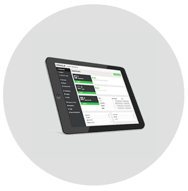
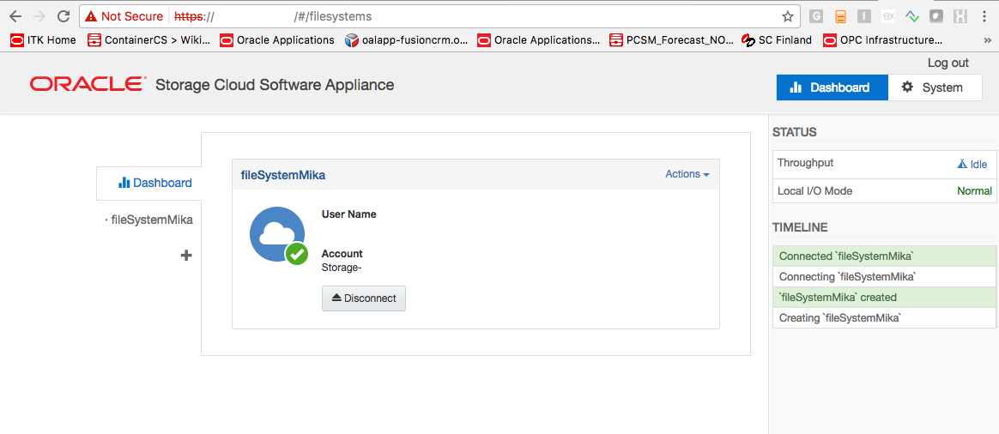
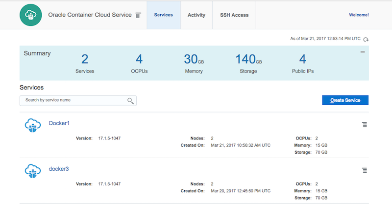
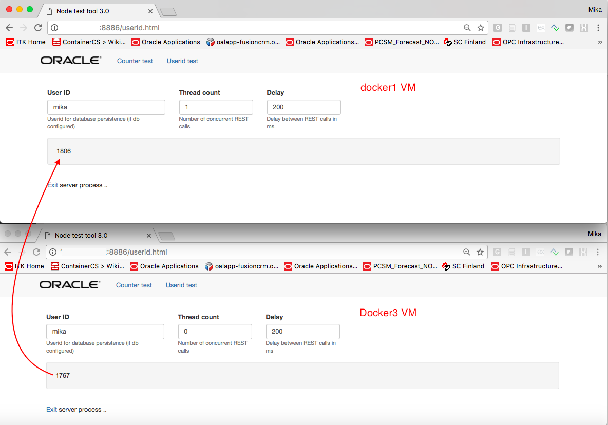
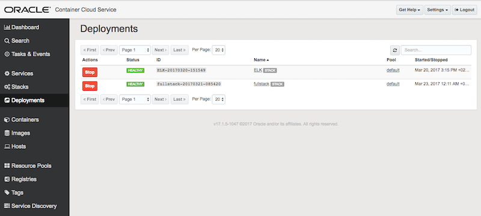
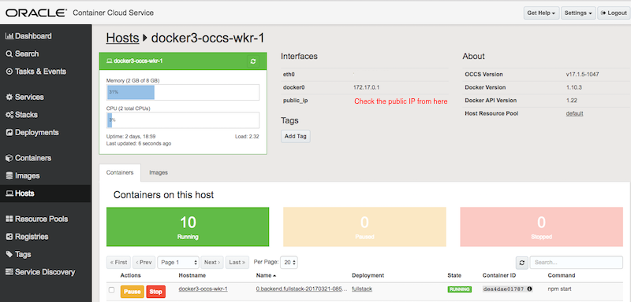

# Backing up Docker's data in Oracle Container Cloud Service in Oracle Storage Cloud Service

Copied from my <a href="https://www.linkedin.com/pulse/test-mika-rinne">linked in article</a>.

## Step 1. Creating the Oracle Storage Cloud software appliance

The first thing to do is to install the OSCSA to the cloud. OSCSA is the component that talks REST to the Oracle Storage Cloud and hosts the logical file system that can be then NFS mounted on any of the cloud VM's to store data, including Oracle Container Cloud VM's for running the Docker instances. Here is the <a href="http://docs.oracle.com/en/cloud/iaas/storage-appliance-cloud/sfsug/workflow-setting-appliance.html">workflow</a> for doing this.

After running the appliance installation script on the <a href="http://docs.oracle.com/en/cloud/iaas/storage-appliance-cloud/sfsug/provisioning-appliance.html#GUID-0990C0DF-3514-4E58-B2AB-80C1603826B6">step 5</a> of the workflow from my OSX I got the appliance nicely setup in the cloud and ready to go.

#### OSCSA console showing my example file system

## Step 2. NFS mounting the appliance file system on the Container Cloud VM's

After installing the appliance the next step is to mount it's file system on client VM's.

Since we are using the VM's that run the Dockers in Container Cloud Service there is a few more steps than on regular compute instances, but it is not much. I describe them here.

When setting up an Oracle Container Cloud Service to the cloud, you specify how many worker nodes that service consists of. Each worker node will be then an individual VM of a desired shape as part of the Container Cloud Service instance and can be accessed with ssh and the public key you have.

#### Example Docker instances in Oracle Container Cloud Service console

The first thing to do is to ssh login to a worker node VM with it's public IP address and the opc user. The address is visible in the Container Cloud Service console as well as in the excellent <a href="http://docs.oracle.com/en/cloud/iaas/container-cloud/contu/accessing-container-console-oracle-container-cloud-service.html#CONTU-GUID-F802EDD4-E193-4921-9018-A09022DB4003">Container</a> Console of the service to run and orchestrate your Dockers.

When you login (for example: <i>ssh opc@140.86.9.30</i>) you can see the VM runs on Oracle Linux Server release 6.6.x

The next step is to install nfs-utils for NFS mounting and to do this there are three things:
<ul>
<li>Using <i>sudo vi /etc/yum.repos.d/public-yum-ol6.repo</i> copy the contents of <a href="public-yum-ol6.repo">this file into it</a>. (However, if the file is there you don't have add or edit it. On regular OL6.6 compute nodes this is the case.)</li>
<li>Using <i>sudo vi /etc/yum.conf</i> remove the proxy configurations in the end of the file. You can comment (#) them out.
Finally do sudo yum install nsf-utils.</li>
<li>After this is done let's create the OSCSA NFS mounting point for Dockers to use. This is used to store files in the Oracle Storage Cloud service.</li>
</ul>

First, let's look at the <a href="fullstack_example.yaml">example stack YAML</a>. The <a href="fullstack_example.yaml#L56">volume</a> specifies the location in the VM's file system to MongoDB to use for it's persistent data. The data does not disappear even the Docker stack instance is deleted and created again.

Do <i>sudo mkdir /var/lib/mongodb</i> to create this.

Next follow <a href="http://docs.oracle.com/en/cloud/iaas/storage-appliance-cloud/sfsug/mounting-appliance-filesystems-client-instances.html">these</a> steps to complete the NFS mounting. When adding the mounting point to /etc/fstab it's best to use tabs between values.

After saving do <i>sudo mount -a</i>.

## Step 3. Reboot the Docker on the Container Cloud VM

It appears that before Docker stack instances can actually access the mounting point for reading and writing the Docker daemon needs to be rebooted.

Do sudo service docker stop and then sudo service docker start for this as a the last step of the installation.

Now all should be set and you can try spinning up a Docker stack instance from the <a href="http://docs.oracle.com/en/cloud/iaas/container-cloud/contu/accessing-container-console-oracle-container-cloud-service.html#CONTU-GUID-F802EDD4-E193-4921-9018-A09022DB4003">Container Console</a> of this VM. To do this you can use the stack from this <a href="http://github.com/mikarinneoracle/sw-appliance/blob/master/fullstack_example.yaml">example YAML</a> to save MongoDB data to the mounting point.

## Step 4. Testing the mounting point on another Container Cloud Service VM

By following the step 2 on another VM the MongoDB data should be automatically loaded and sync'ed to /var/lib/mongodb after doing the sudo mount -a. 

Do <i>ls -la /var/lib/mongodb</i> to see the same MongoDB files on the this second VM as in the first one. Voilà!

If you want to fully test MondoDB working in this example, do the following (see screenshots at the end of this page):

<ul>
<li>
Call the example stack from browser using haproxy port 8886 and running some "laps" for a user named "demo" (use the IP address of the example stack's haproxy instance on the first VM and then click the tab "Userid test" from the menu). See the value counting for the user "demo".</li>
<li>Reboot the Docker daemon for second VM, too, as described on the step 3.</li>
<li>Stop the stack example instance on the first VM.</ul>
<li>Spin up the the stack demo on the second VM. Repeat step 1 for this VM using it's example stack's haproxy instace's IP address and port 8886. The expected result should be that the example Docker stack for user "demo" continues counting from the point where it was left in the step 1.</li>
</ul>
 

You may try iterating this a few times to see how it works!

#### Example stack testing tool

#### Oracle Container Cloud Service and the example stack

#### IP address of the example stack's MongoDb Docker instance

